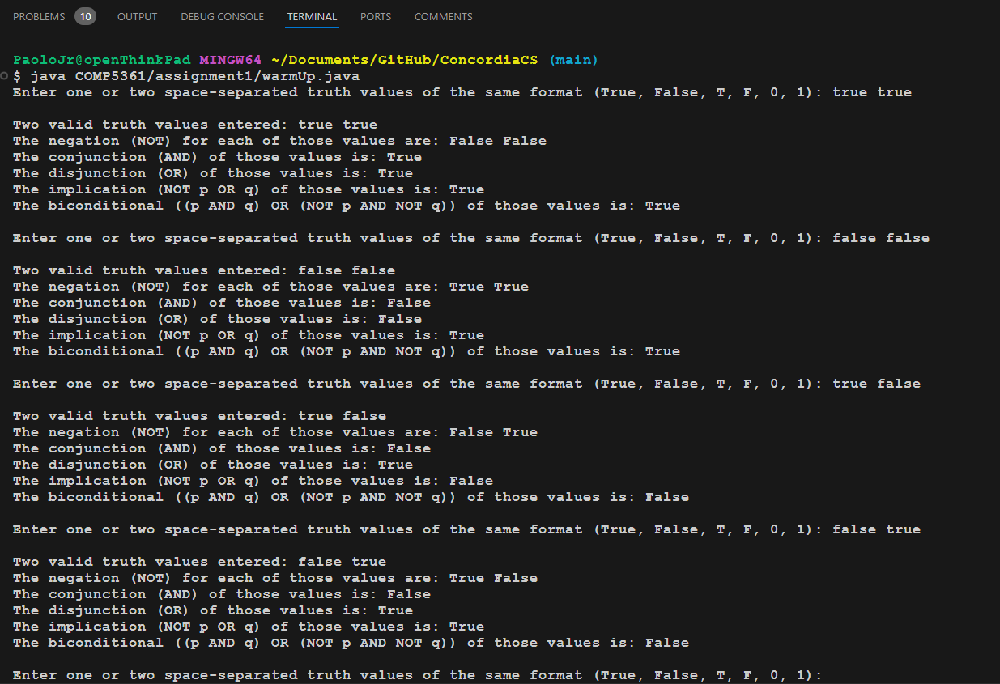
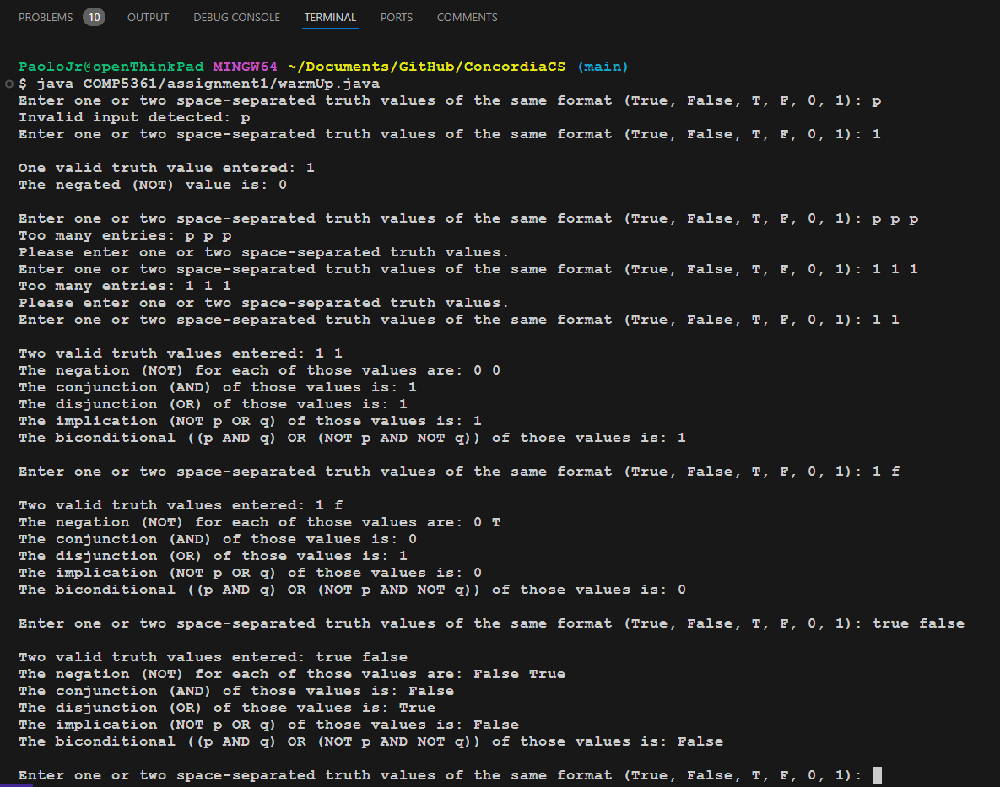
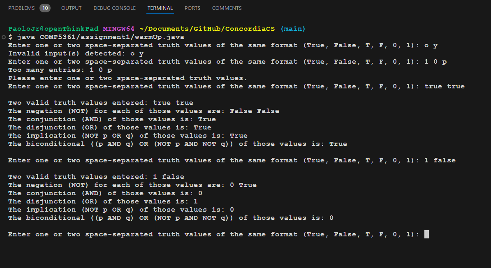

### notes on error-handling in [warmUp.java](./warmUp.java)
- the user may enter 1 or 2 values from the command-line interface (CLI); acceptable/valid values are 
    - 'True' / 'False'
    - 'T' / 'F'
    - '1' / '0'
    - inputs must be space-separated
- there is a continuous while-loop that keeps prompting the user, whether or not they entered correct values
- when inputs > 2, the program will output an error message - it will not validate the inputs; the user may retry at the next prompt
- when only 1 input is sent, and after validation, only the negation function will be executed since it requires a single input
- when 2 inputs are sent, and after validation, all functions (including negation) are executed
- the negation function will uniquely validate the individual inputs
    - ex: 'T' 'T' will output 'F' 'F'
- user-inputs are validated against the HashMap containing the acceptable inputs as keys and their boolean-equivalents as values
- when validated, the user receives confirmation with a message
- when the number of inputs is correct, but one of the values is invalid, the user receives an error message along with another prompt to retry
- the program will return values (from the five functions) dependant on the format of the truth values submitted
    - ex: if 'T 0', then for negation the program will return 'F 1'
    - for the other functions, it will output in the format of the first input
- the program can be terminated with 'CTRL-C'

#### Here are some snapshots:

